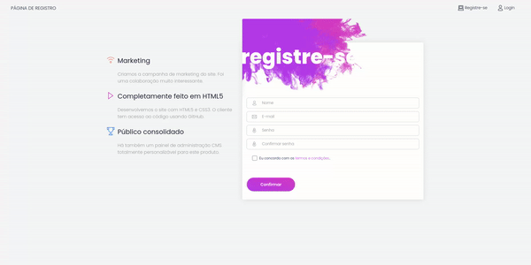

# Sistema de notícias - DixDigital

Desenvolvimento de Aplicação Web com Laravel, Gerenciamento de Usuários, e CRUD de Notícias.

- - -

## Visão geral

Este projeto consiste no desenvolvimento de uma aplicação web utilizando o framework PHP Laravel, com uma interface de usuário baseada no template gratuito White Dashboard Laravel fornecido pela Creative Tim. O objetivo principal é criar um sistema completo que permita o gerenciamento de usuários e um CRUD (Create, Read, Update, Delete) para notícias, incorporando uma interface amigável e responsiva.

- - -

## Requisitos do projeto 

* Framework
  * Utilizar o framework PHP/Laravel como base para o desenvolvimento da aplicação. Isso proporciona uma arquitetura robusta e eficiente, seguindo boas práticas de desenvolvimento.
* Interface do usuário
  * Implementar a interface do usuário fornecida pelo template White Dashboard Laravel da Creative Tim. Isso garantirá uma experiência visual moderna e agradável para os usuários da aplicação.
* Gerenciamento de usuários
  * Criar um sistema de gerenciamento de usuários que inclua funcionalidades como registro, login, edição de perfil e exclusão de conta. As páginas relacionadas a essas funcionalidades devem respeitar o design e a estrutura fornecidos pelo template.
* CRUD de notícias
  * Implementar um CRUD para notícias, permitindo que os usuários criem, visualizem, editem e excluam suas próprias notícias. Utilizar formulários intuitivos para facilitar a interação do usuário com a aplicação.
* Pesquisa de notícas
  * Integrar uma funcionalidade de pesquisa na listagem de notícias, permitindo que os usuários encontrem rapidamente as informações desejadas.
* Restrição de acesso a notícas
  * Implementar uma regra de acesso para garantir que cada usuário só possa visualizar e gerenciar suas próprias notícias. Restringir o acesso às notícias de outros usuários é crucial para garantir a privacidade e segurança dos dados.
* Versionamento no git
  * Utilizar o Git como sistema de controle de versão para o código-fonte do projeto. Criar branches específicos para funcionalidades ou correções, e enviar Pull Requests para a revisão de código.

- - - 

### Projeto

#### Página de registro

Nessa página os usuários podem se registrar no sistema e são automaticamente redirecionados ao painel principal. O nível de acesso por padrão é o "comum".

* Formulário de registro
  * Todos os campos estão devidamente validados :white_check_mark:
  * Validação contra e-mails inválidos :white_check_mark:
  * Validação contra e-mails já em uso :white_check_mark:
  * Senha de no mínimo 8 caracteres :white_check_mark:
  * Verificação de confirmação de senha :white_check_mark:

